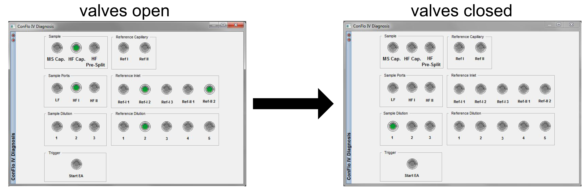

# Closing Conflo Valves

[🏠](../README.md)

***

Please contact the Stable Isotope Ecology Laboratory Technical Director with any questions or clarifications. **StableIsotopes@ucmerced.edu**

***

## Prerequisites 

Please check all prerequisites and complete any linked guides before continuing.

- [ ] An Isodat sequence is not currently runnings

## Supplies Needed

- [ ] None

*** 

## Introduction

Before loading samples or otherwise opening the *Costech 4010 Elemental Combustion System* or the *ThermoFisher TC/EA* **you must** isolate the mass spectrometer from the peripheral instruments. Failure to do so can ruin analyses and cause significant damage to the mass spectrometer. 

## Instructions

In *Isodat Acquisition* scroll down to find the `Conflo IV Diagnosis` panel in the sidebar. Toggle all valves and capillaries off by clicking all green radio buttons. Note that one value under `Sample Dilution` will always remain open and Isodat will not allow it to be turned off. This ensures that the *Conflo IV* sample open split maintains a helium atmosphere. 

