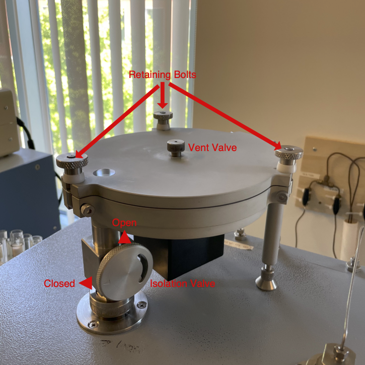
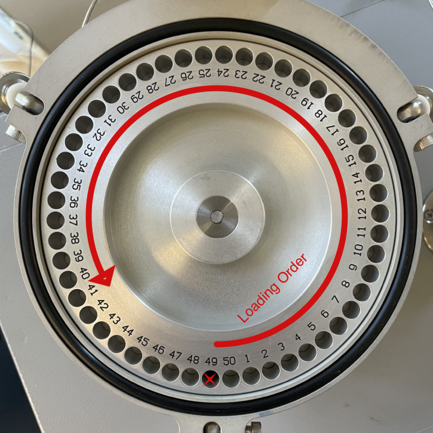

# Loading the Costech 4010 Zeroblank Autosampler

[🏠](../README.md)

***

Please contact the Stable Isotope Ecology Laboratory Technical Director with any questions or clarifications. **StableIsotopes@ucmerced.edu**

***
## Prerequisites 

Please check all prerequisites and complete any linked guides before continuing.

- [ ] Conflo IV valves are closed (see [closing conflo valves](../conflo/closing_conflo_valves.md))

## Supplies

- [ ] Gloves
- [ ] Eye protection
- [ ] Forceps
- [ ] Tray of fully prepared samples

*** 

## Introduction

The *Costech 4010 Elemental Combustion System* *Zeroblank Autosampler* holds samples in an air-free helium atmosphere and automatically drops samples into the Costech 4010 for analysis. This document will help you load samples into the   *Zeroblank Autosampler* for analysis.

## Steps

### Load Samples

Before loading samples **you must** isolate the mass spectrometer from the EA.  **Failure to do so can cause significant damage!** 

||
|:--:|
|*Diagram of the ZeroBlank Autosampler*|

* Close the isolation valve on the autosampler drop-tube by turning it so the arrow is horizontal. At this point you should not be able to see the hot glowing column through the window on the top of the autosampler.
* Open vent valve in the middle of the autosampler. There should be an audible hiss as gas escapes.
* Loosen and fold down the three retaining bolts on top of the autosampler and prop up the autosampler lid.
* Use a pair of forceps to load samples from the 96 well tray. Start at the hole directly to the right of the autosampler drop-tube and work counter clockwise. Do not place a capsule in the hole directly over the drop-tube! 

||
|:--:|
|*ZeroBlank Autosampler carousel loading direction. Do not place a capsule in the hole directly over the drop tube.*|

* When you are done loading, make sure there are no sample capsules left in the 96 well tray and make you have loaded only 1 capsule into each autosampler hole. 

### Purge Autosampler

The Zeroblank autosampler must be purged with helium to remove CO2 and N2 from the air.

* Close the Zeroblank autosampler lid and tighten the three retaining bolts a quarter turn at a time until they are tight.
* Leave the center vent valve open and *slowly* open the isolation valve by turning it so the arrow points directly up. 
    * You should hear are whine (this is normal) from the EA and there will be gas flow out of the purge valve. 
* Set a timer for 5 minutes.
* Close the vent valve after 5 minutes.
* **DO NOT CLOSE** the isolation valve after purging.