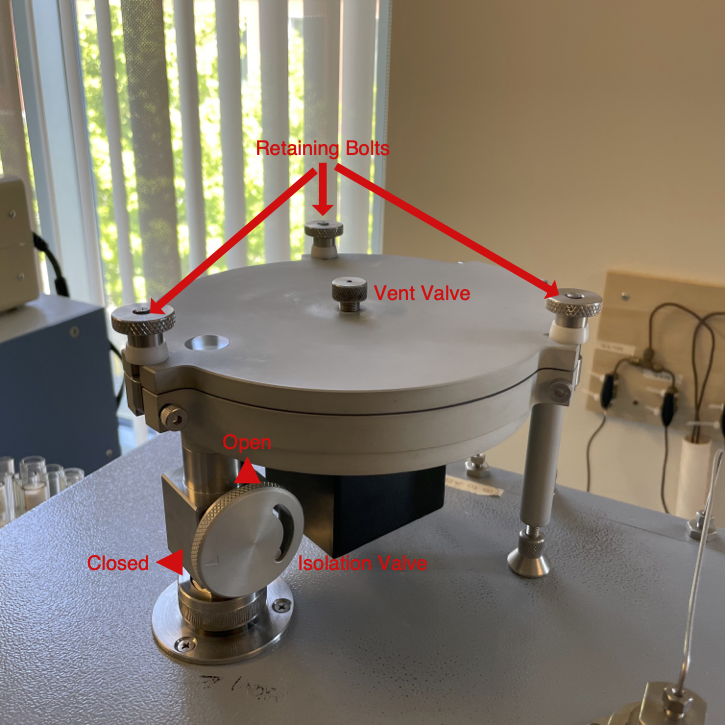

# Changing and Aligning the Zeroblank Autosampler Carousel  

[🏠](../README.md)

***

Please contact the Stable Isotope Ecology Laboratory Technical Director with any questions or clarifications. **StableIsotopes@ucmerced.edu**

***

## Prerequisites

Please check all prerequisites and complete any linked guides before continuing.

- [ ] Conflo IV valves are closed (see [closing conflo valves](../conflo/closing_conflo_valves.md))

*** 

## Introduction

The Costech 4010 Zeroblank autosampler has 3 different carousel sizes, a 32-well 50-well, and 100-well autosampler carousel. Different sizes can be used depending on the number of samples in analytical batch and the diameter of the tin capsules being analyzed. if you are uncertain about which carousel to use please consult the Stable Isotope Ecology Laboratory Technical Director. 

## Steps

### Remove Existing Carousel

||
|:--:|
|*Diagram of the ZeroBlank Autosampler*|

* Close the isolation valve on the autosampler drop-tube by turning it so the arrow is horizontal. At this point you should not be able to see the hot glowing column through the window on the top of the autosampler.
* Open vent valve in the middle of the autosampler. There should be an audible hiss as gas escapes.
* Loosen and fold down the three retaining bolts on top of the autosampler and prop up the autosampler lid.
* Remove the installed carousel by pulling straight up on the center of the carousel. It should slide out easily.

||
|:--:|
|*The Zeroblank autosampler without a sample carousel installed.*|

### Install New Carousel

* select the appropriate sized carousel your samples (32, 50, 100).
* The autosampler carousel has an upper body with sample-wells and a base plate that spins freely.
* The baseplate has 3 holes in it. A center post-hole, a peg-hole and a sample-drop hole. 

||
|:--:|
|*Underside of a Zeroblank autosampler carousel showing the 3 holes.*|

* The center post of the Zeroblank autosampler has a flattened edge that must be aligned with the corresponding flattened edge of the center-post hole on the carousel. 
* You must also align the peg and peg-hole to ensure the base plate cannot move during autosampler operation. 
* Since the carousel base plate can spin freely, rotate it so the flattened edge on the center-post hole and the peg-hole are aligned with the autosampler body. This takes some trial and error. 
* If everything is aligned properly the carousel should drop into Zeroblank autosampler body and the center post will be flush with the top of the carousel.

### Configuring the Autosampler

* Now that a new carousel is installed you 🚨**must**🚨 change the autosampler setting in the Costech 4010 menu and align the carousel. Failure to do so will result in lost analyses. 

* Using the ⬆️/⬇️ arrow keys navigate to the select autosampler menu on the Costech 4010 screen.
    * **If the buttons are unresponsive**, press `abort` and `enter` on the keypad.

||
|:--:|
|*Select Autosampler screen.*|

* Use the ⬅️/➡️ arrow keys to move the cursor to the `AUTOS 50/32/100` line.
* Enter the appropriate number in brackets `<#>` to the appropriate auto sampler size. 
    * `<1>` for 50-well
    * `<2>` for 32-well
    * `<3>` for 100-well
* Confirm your selection by pressing `enter`. The word `OK` should appear above the selection. 

### Aligning the Autosampler

* The autosampler 🚨**must**🚨 be aligned before use. Failure to do so will result in lost analyses.

* Using the ⬆️/⬇️ arrow keys navigate to the autosampler alignment menu on the Costech 4010 screen. The menu will say `EL. AUTOSAMPLER` at the top.
    * **If the buttons are unresponsive**, press `abort` and `enter` on the keypad.

||
|:--:|
|*Select Autosampler screen.*|

* The autosampler alignment menu has 3 options. They can be selected using the ⬅️/➡️ arrow keys.
    * `GO   <:>`
    * `JOG+ <:>`
    * `JOG- <:>`
*  Select `GO` and press `enter`. This will rotate the autosampler forward 1 step/ hole. 
*  The first step after installing a new carousel is usually a little weird.   Select `GO` and press `enter` a few times until the autosampler is consistently moving exactly one hole. Wait at least 10 seconds between presses. Pressing `enter` rapidly can confuse the autosampler.
*  Align the autosampler using `JOG+`. `JOG+` will continuously rotate the autosampler clockwise. 
*  Select `JOG+` and press `enter`. Press `enter` again to stop the rotation.
    *  Avoid using `JOG-` to rotate the autosampler counter clockwise.
*  Align the autosampler so that the autosampler well over the drop-tube *slighty* overshoots and there is a sliver of the drop tube visible in the next hole counter-clockwise.
*  Select `GO` and press `enter` one more time to make sure the alignment is consistent.
*  If you are loading samples you may do so now. See [Loading the Costech 4010 Zeroblank Autosampler](./costech_EA/EA_zeroblank.md), Otherwise close the Zeroblank autosampler lid and tighten the retaining bolts and vent valve. 

||
|:--:|
|*View of a correctly aligned carousel. In this case hole-1 would be over the drop tube. and there is a sliver visible in hole 2.*|