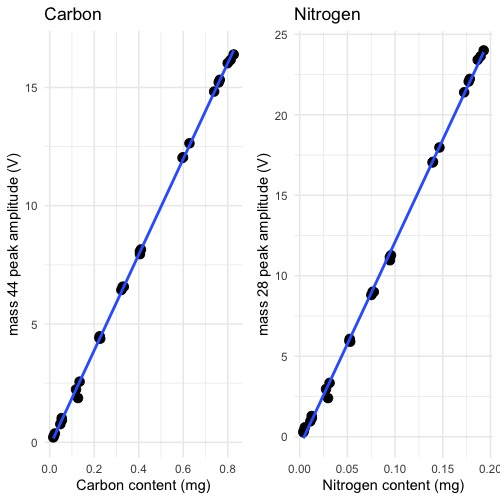
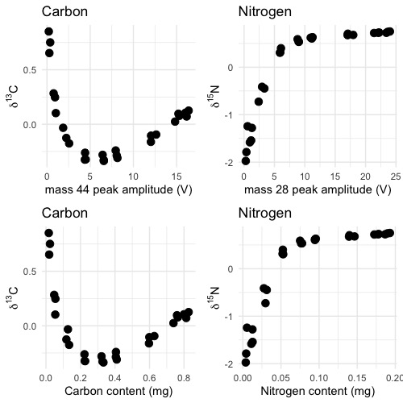

# Costech 4010 Elemental Analyzer Sample Size Determination v0.2

***

Please contact the Stable Isotope Ecology Laboratory Technical Director with any questions or clarifications. **StableIsotopes@ucmerced.edu**

*** 

# Introduction
Determining the correct sample size for δ13C and δ15N analyses is important because the mass spectrometer signal intensity, sensitivity, and reproducibility is related to sample mass. These notes make three assumptions.

1. The the carbon and nitrogen content of a material is known prior to analysis.

2. Analysis is taking place in the University of California, Merced Stable Isotope Ecology laboratory using a *Costech 4010 Elemental Analyzer*. 

	* Other laboratories have similar instrumentation setups, however instrument sensitivity will vary between configurations.

3. The *Delta V+ IRMS* CO2 sample dilution is set to 89%.

	* This is the default configuration for routine analyses. Other configurations are possible but you should contact the Technical Director prior to sample preparation.

# Background
The signal intensity of a sample gas measured by a *Delta V+ isotope ratio mass spectrometer* is directly related to the amount of sample gas. In the case of the *Costech 4010 Elemental Analyzer* the signal intensity is linearly related to sample carbon and nitrogen content (Figure 1).

The *Delta V+ isotope ratio mass spectrometer* has a measurement range from 0 to 50 volts. However the sensitivity is best below about 30 volts. Furthermore, both δ13C and δ15N have have a non-linear relationship to signal intensity. This means that a sample with a small signal intensity will have a different measured δ value than a sample of the same material at a large signal intensity. 

The δ-value-mass-dependence is linear and lowest between about 5 to 15 volts for δ13C and 5 to 25 for δ15N (@fig:linearity). Since the relationship between signal intensity (volts) is linearly related to carbon and nitrogen content (Figure 2), this equates to the mass range shown in @tbl:ranges.

|     isotope     | minimum (mg) | maximum (mg)  |
|:---------------:|:------------:|:-------------:|
| δ13C |      0.2     |      0.8      |
| δ15N |      0.05    |      0.2      |
: minimum and maximum carbon and nitrogen contents for δ13C and δ15N analysis

# Calculating Sample Size

If the carbon and nitrogen content of a material is known prior to analysis you can calculate the optimal sample size using the following equations to calculate the range of sample weights for carbon and nitrogen. 

## δ13C Range

$$Sample size_{min} = 0.2 ÷ (sample carbon percent ÷ 100)$$

$$Sample size_{max} = 0.8 ÷ (sample carbon percent ÷ 100)$$

## δ15N Range

$$Sample size_{min} = 0.05 ÷ (sample nitrogen percent ÷ 100)$$

$$Sample size_{max} = 0.2 ÷ (sample nitrogen percent ÷ 100)$$

# Measuring both δ13C and δ15N

It is difficult to concurrently measure δ13C and δ15N in samples with high C:N ratios. Based on the sample ranges given in Table 1 the maximum C:N ratio is about 16 ($carbon maximum ÷ nitrogen minimum$ or $0.8 ÷ 0.05$) and the minimum C:N ratio is 1 ($carbon minimum ÷ nitrogen maximum$ or $0.2 ÷ 0.2$). For analyses of materials with C:N ratios outside this range please consult the Technical Director prior to sample preparation.

If your samples have a C:N ratio between about 1 to 16 then δ13C and δ15N can be measured concurrently. Calculate the range of acceptable sample sizes using the equations for carbon and nitrogen shown above and then choose a final sample size that overlaps both results. If your samples have a C:N ratio significantly outside this range then δ13C and δ15N may need to be measured separately. Please consult the Technical Director for guidance.

# Worked Example
Acetanilide is common reference material that is 71.09% carbon and 10.36% nitrogen (@tbl:common).

## δ13C

$$sample~size_{min} = 0.28~mg = 0.2 \div (71.09 \% \div 100)$$
$$sample~size_{max} = 1.13~mg = 0.8 \div (71.09 \% \div 100)$$

## δ15N

$$Sample~size_{min} = 0.48~mg = 0.05 \div (10.36 \% \div 100)$$
$$Sample~size_{max} = 1.93~mg = 0.2 \div (10.36 \% \div 100)$$

In this case the minimum sample size for δ13C measurements is lower than the minimum for measuring δ15N. the minimum sample size for δ15N analysis is in the middle of the range for δ13C so a sample size of **0.5 mg** would be appropriate.

# Commonly Analyzed Materials

|   material    |     carbon %    |    nitrogen %   | target weight (mg) |
|:-------------:|:---------------:|:---------------:|:------------------:|
| acetanilide   |      71.09      |      10.36      |        0.4         |
| biochar       |      > 80       |    < 1.5        |      variable      |
| collagen      |     40 - 45     |     10 - 15     |        0.5         |
| glutamic acid |      40.3       |      9.52       |        0.5         |
| keratin       |     40 - 45     |     10 - 15     |        0.5         |
| plants        |     40 - 50     |    < 1 - 5      |       1 - 1.5      |
| proteins      |     40 - 45     |     10 - 15     |        0.5         |
| soil          | highly variable | highly variable |   highly variable  |
: Carbon and nitrogen contents of commonly analyzed materials.

