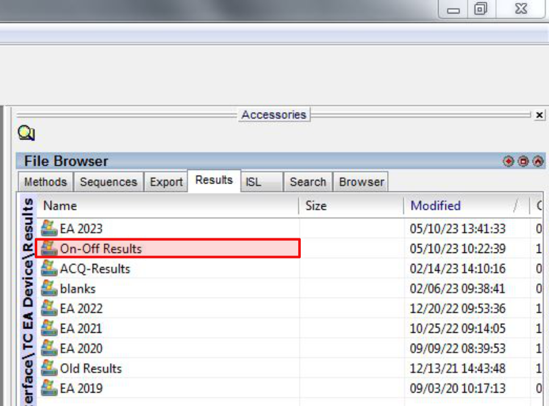
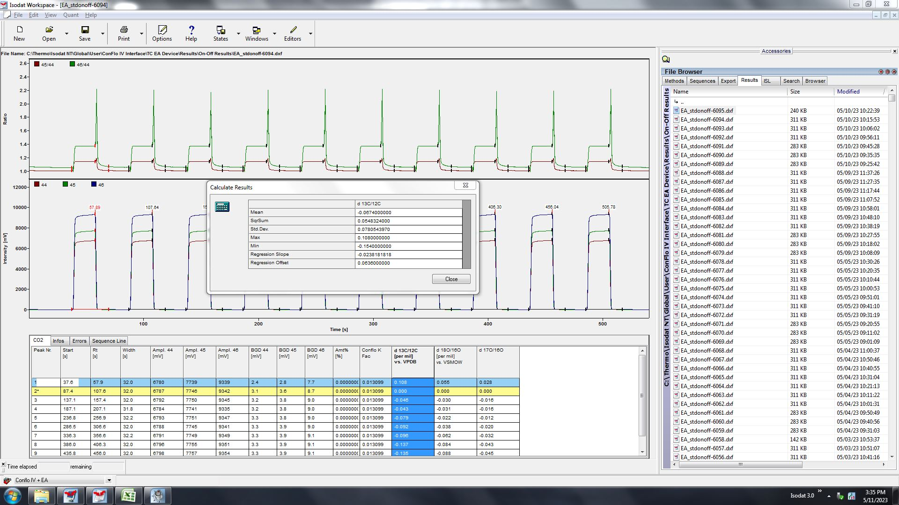
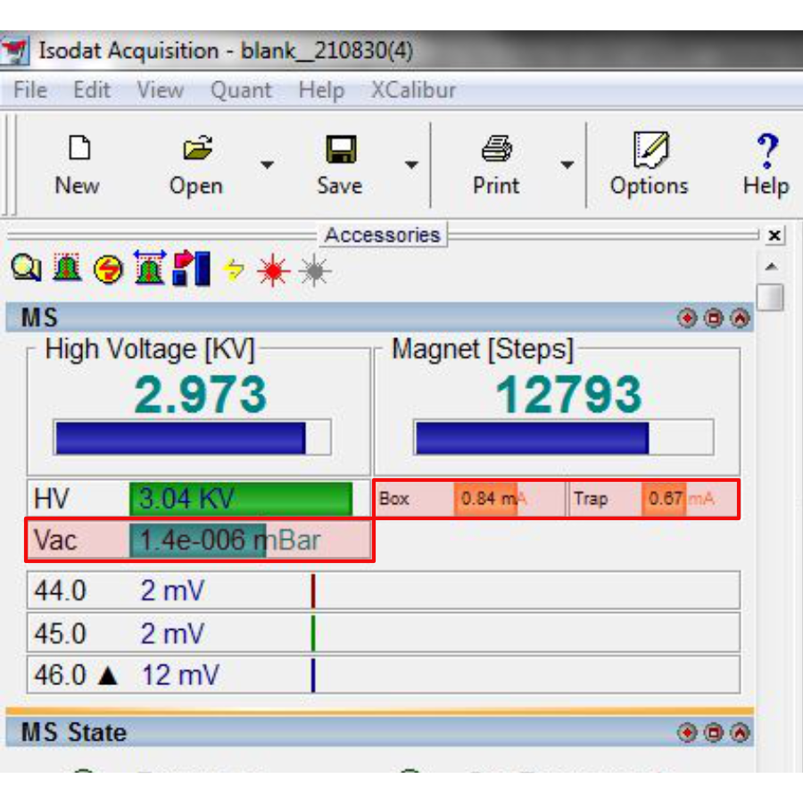
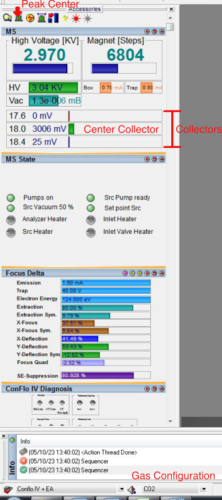

# Starting a Costech 4010 Sequence

[🏠](../README.md)

***

Please contact the Stable Isotope Ecology Laboratory Technical Director with any questions or clarifications. **StableIsotopes@ucmerced.edu**

***

## Prerequisites

Please check all prerequisites and complete any linked guides before continuing.

- [ ] [Loading the Costech 4010 Zeroblank Autosampler](../costech_EA/EA_zeroblank.md) 
- [ ] [Warming up the Costech 4010](../costech_EA/warming_up_costech.md)
- [ ] [Starting Costech 4010 CO2 and N2 On-Offs ](../isodat/EA_on_offs.md)
- [ ] [Setting up a Costech 4010 Isodat Sequence](../isodat/isodat_sequence.md)

*** 

## Introduction

This guide covers the final steps for setting up batch of analyses using the Costech 4010 Elemental Combustion System. After completing the prerequisites listed above you will need to finish filling out the *Instrument Run Log* before starting your sequence. 

## Steps

### Record On-Off Reproducibility 

* The on-off results are saved in the `/On-Off Results/` Folder

||
|:--:|
|*On-Offs results folder*|

* Open the most recent CO2 and N2 on-off result files.  
* Click on the column header labeled `d 13C/12C [per mil] vs. VPDB` and `d 15N/14N [per mil] vs. AIR`  to highlight all the rows. 
* Right click and select `Calculate`. 
* Check the standard deviation (`Std. Dev.`). The instrument is ready run if the standard deviation is ≤0.5‰ for both δ13C and δ15N. 
* Record the standard deviation of the most recent CO2 and N2 on-off result file in the instrument run log in the `δ13C` and `δ15N` columns.  

||
|:--:|
|*Example of a CO2 on-off result file.*|

### Record Instrument Parameters

* Record the values shown in the `Box`, `Trap`, and `Vac`, readouts from Iosdat Acquisition in the *Instrument Run Log*. 
    * The `Box` and `Trap` values should be stable and should sum to 1.5. If they are fluctuating rapidly, stop and contact the Technical Director. 

||
|:--:|
|*Location of `Box`, `Trap`, and `Vac` readouts in Isodat Acquisition*|

### Record Backgrounds

The background measurements for each gas should be roughly the same as the measurements from the previous day. If any of gases have a measurement significantly higher than the previous date (i.e., 1000 vs 100) contact the Technical Director.

* Record a background measurement for carbon dioxide (`mass_44_mV`), argon (`mass_40_mV`), nitrogen (`mass_30_mV` & `mass_28_mV`), and water (`mass_18_mV`) in the *Instrument Run Log*. 
* For carbon dioxide, argon, and nitrogen, select the appropriate gas from the gas configuration drop-down menu in the bottom left of *Isodat Acquisition*.
    * Wait for the mass spectrometer to switch configurations and then record the readout from the appropriate collector. 

||
|:--:|
|*Location of the Peak Center button, Gas Configuration drop-down and Collectors in Isodat Acquisition.*|

* There is no gas configuration for water (`mass_18_mV`). 
* Right click on the center collector and select `jump to mass`. 
* Type 18 in the window that pops up and click OK. 
* Wait for the switch to happen (*Isodat Acquisition* will look like it's crashing). 
* After the switch click the `Peak Center` button. It's the left-most icon that looks like a small green bell at the top of the panel). 
* Let the peak center finish and record the readout in the *Instrument Run Log.* 

### Start Sequence

* Double check that the Costech 4010 is in `work` mode and is ready. 
    * All three lights on the front should be green
    * There should be no red or blank lights 
* Double check that the sequence is complete.
    * `Identifier 1`, `Identifier 2`, `Amount`, and `Method` columns are correct.
    * Save `Options` are set correctly. 
* Double check that the *Instrument Run Log* is filled out completely.
    * All columns should have a value.
* Open the sequence file you created when [Setting up a Costech 4010 Isodat Sequence](../isodat/isodat_sequence.md).
* Highlight all rows by clicking on the `Row` column header in the upper left of the sequence. 
* Click the green `Start` button. 
* Click OK. 
* The sequence should start 🎉.
* Check on your analyses periodically to check for analytical problems. 