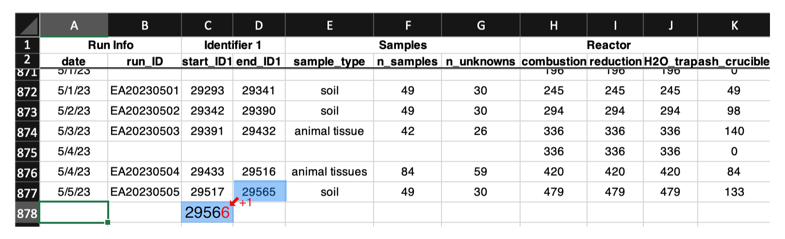
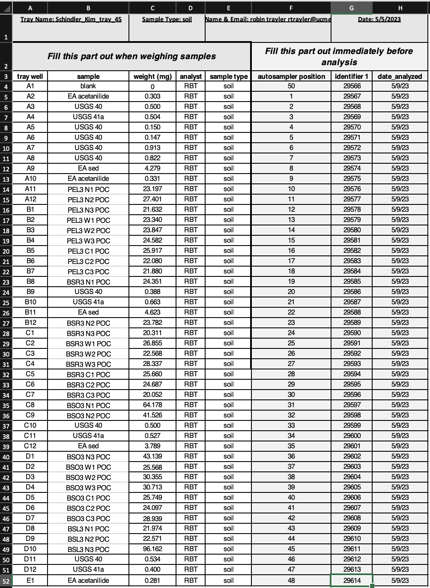
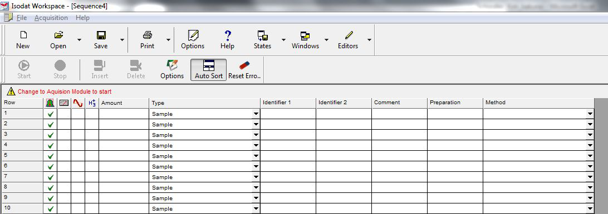

# Setting up an Isodat Sequence

***

Please contact the Stable Isotope Ecology Laboratory Technical Director with any questions or clarifications. **StableIsotopes@ucmerced.edu**

***

## Supplies

- [ ] Typed weight sheet using the one of *SIELO weigh sheet templates* 

*** 

## Introduction

An *Isodat sequence* file is required for all analyses on the Costech 4010, ThermoFisher TC/EA, ThermoFisher Gasbench II, and ThermoFisher GC-Isolink instruments. This guide covers the basics of setting up routine analytical sequences for these instruments. If you need to set up a specialized sequence (e.g., for method development or instrument testing) please consult the Technical Director. 

## Instrument Run Logs

Each instrument has an *Instrument Run Log* excel file located in `~/Box Sync/Instrument Run Logs/`. There are two log files, one for each Delta V+ mass spectrometer. **All analyses** must be entered into the appropriate *Instrument Run Log*.

### Starting a New Run in the Instrument Run Log

Setting up an Isodat sequence begins by starting a new row in the appropriate *Instrument Run Log*. Each new row starts with a the `date` of analysis and creating a new `run_ID`.

* In the `date` cell enter the date in `day/month/year` format.
* The `run_ID` is the name of the instrument (`EA`, `GB`, `TCEA`, `GCC`) followed by the date in `year-month-day` order. For example a set of samples analyzed on September 10, 2021 using the Costech 4010 would be named `EA202109010`. 

Each analysis within a run is also given a unique identifier number referred to as `Identifier 1`. 
* in the `start_ID1` column enter the first `Identifier 1` number for your run. This number is the `end_ID1` from the previous row +1. You will fill in the `end_ID1` for the current row later. 

 
 *The first columns of the Costech 4010 Instrument Run Log, showing the creation of a new set of Identifier 1 numbers.*
 
 * In the `sample_type` column enter the general type of material being analyzed (e.g., soil, animal tissue, feathers, plants, etc). This does not need to be very specific. 
 *  In the `n_samples` column enter the total number of things being analyzed (samples + standards). 
 *  In the `n_unknowns` column enter only the number of samples being analyzed (no standards). This is for billing purposes.
 *  Fill out the `combustion`, `reduction`, `H2O_trap`, and `ash_crucible` columns by adding the value from `n_samples` to the previous rows value for each column. 
  
  
 *Example of a completely filled out weigh sheet.*

  
### Fill Out Weigh Sheet

After you have started a new row in the *Instrument Run Log* you can finish filling out the typed weigh sheet. Weigh sheets of samples waiting for analysis are stored in `~/Box Sync/Instrument Run Logs/Sample Run Sheets/Sample To Run/`. 

* Open the appropriate weigh sheet and make sure if all standards and samples are prepared.
* The `tray_well`, `sample`, `weight (mg)`, `analyst`, and `sample_type` columns should already be filled out. If they are not fill them out now.
* In the `autosampler_position` column enter the position you placed each sample in the autosampler (TCEA & EA- Zero blank autosampler; Gasbench- GC Pal Heating Block; GCC- Triplus Autosampler Tray).
* In the `identifier 1` column enter the `start_ID1` number from the *Instrument Run Log*. 
* Drag-and-fill this number in Excel to fill the remainder of the sheet. **Make sure the numbers are increasing by +1 for each cell!**
* Copy the last `identifier 1` number from the weigh sheet and paste it into the `end_ID1` cell in the *Instrument Run Log*.

### Set Up Isodat Sequence

You are now ready to set up an Isodat sequence. 

* In *Isodat Workspace* click **new** in the upper left and select **sequence**. 
* Enter the total number of samples (from `n_samples`) in the small window that pops up and click OK. 
* Maximize the sequence window so that all the columns are visible. 

 
 *Example of a completely blank sequence file.*

  
  
